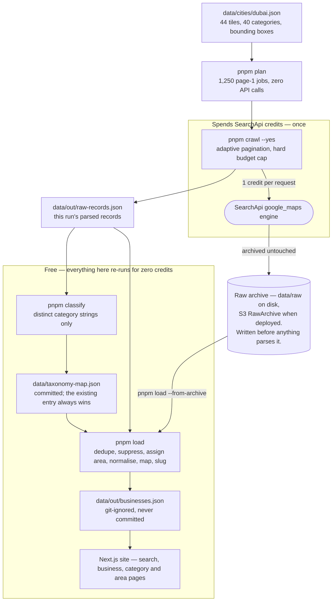
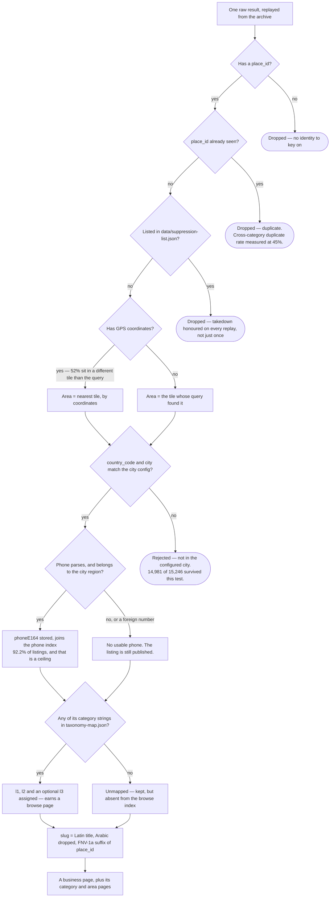
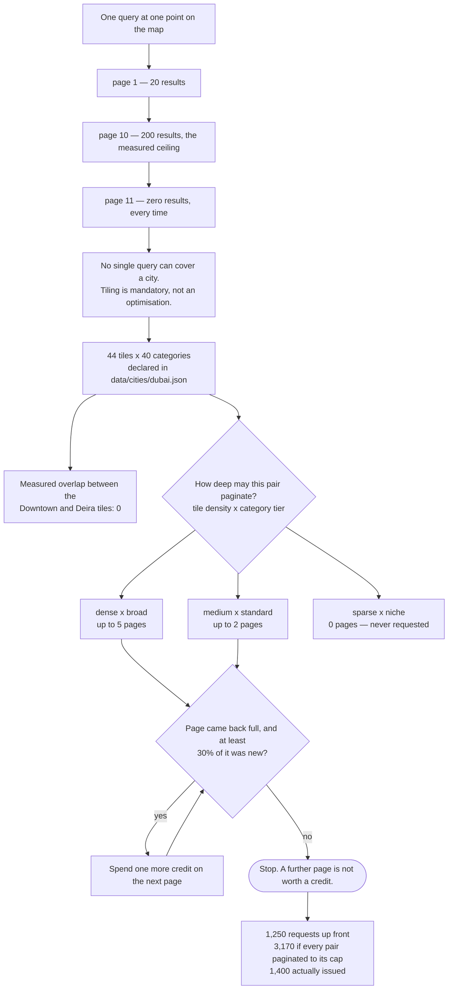
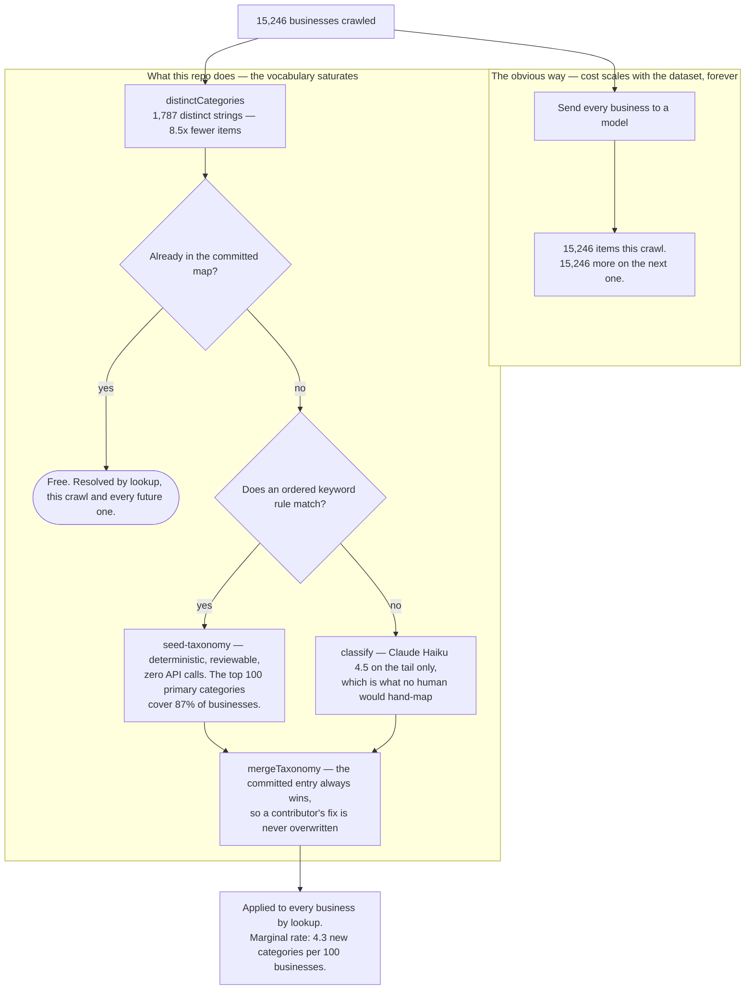
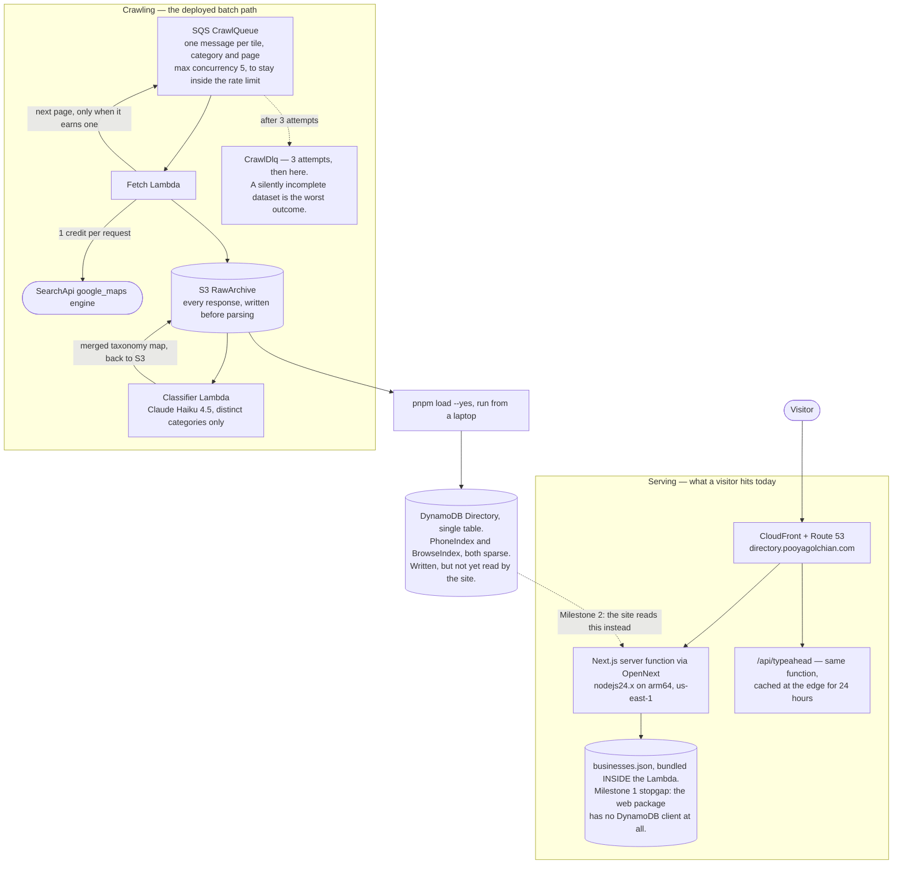
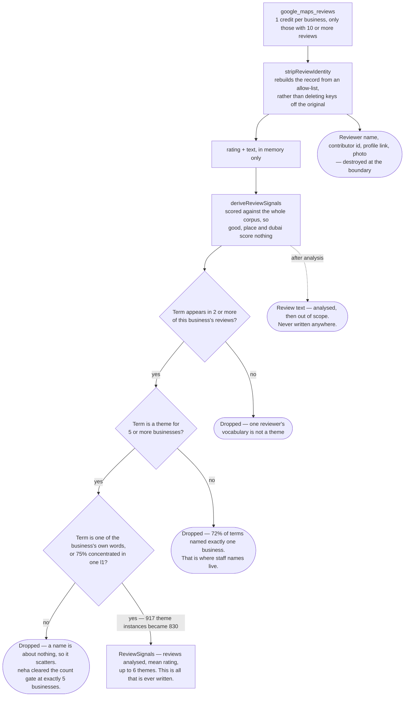

# Directory from Scratch

**An open-source toolkit for building a local business directory for any city,
on [SearchApi](https://www.searchapi.io/)'s Google Maps engine.**

[](https://github.com/pooyagolchian/directory-from-scratch/actions/workflows/ci.yml)
[](./LICENSE)
[](./.nvmrc)
[](./fixtures/searchapi)

> **Where this actually is.** **v0.1 (pipeline) is done and measured** — 1,400
> requests, 15,246 unique businesses, zero errors. **v0.2 (search) is written but
> not served**: `pnpm load --yes` fills DynamoDB and nothing on any page reads it
> yet, and **no latency, Core Web Vitals or ranking numbers are published,
> because none have been taken.** Longer version:
> [where the project stands](#decisions).

Most "how to scrape Google Maps" tutorials stop at one API call and a
`console.log`. This one goes to a working product: a crawl that survives a hard
result ceiling, a deduplicated dataset, a taxonomy pass that costs almost
nothing, real search-demand measurement, and a browsable site over ~15,000
businesses.

**The crawl is city-agnostic.** Tiles, categories, bounding boxes, country code
and phone region all live in [`data/cities/<id>.json`](./data/cities), and
nothing in the pipeline hard-codes a city. Porting the _crawl_ is a JSON file;
porting the _site_ is still a small patch — page titles, the JSON-LD
`addressRegion`, [`lib/data.ts`](./packages/web/lib/data.ts)'s phone parser and
the classifier prompt in
[`classify.ts`](./packages/pipeline/src/classify.ts) all still say Dubai.

Reference deployment — not the product, see
[ADR 0005](./docs/adr/0005-toolkit-not-directory.md) —
**[directory.pooyagolchian.com](https://directory.pooyagolchian.com)** ·
written up at **[pooyagolchian.com](https://pooyagolchian.com)**

---

## What you might want from this

| You are here to…                                                        | Go to                                                                                                                             |
| ----------------------------------------------------------------------- | --------------------------------------------------------------------------------------------------------------------------------- |
| **Read what a real crawl measured**, and what it cost                   | [What the crawl actually measured](#what-the-crawl-actually-measured) · [Five ideas worth stealing](#five-ideas-worth-stealing)   |
| **Run it on my own city**                                               | [Add your own city](#add-your-own-city) · [Why tiling exists](#why-tiling-exists-and-what-a-crawl-costs)                          |
| **Steal one piece** — the ranking, the phone parsing, the taxonomy pass | [What each `packages/core` module decides](#what-each-packagescore-module-decides). It is pure, dependency-light and fully tested |
| **Deploy the whole thing**                                              | [Architecture and deployment](#architecture-and-deployment)                                                                       |
| **Get unstuck** — an error message, a build that will not start         | [Troubleshooting](#troubleshooting)                                                                                               |

## Quickstart

**Requirements:** Node 24 (pinned in [`.nvmrc`](./.nvmrc); `package.json`
declares `engines.node >= 24` to match the `nodejs24.x` Lambda runtime) and
pnpm 10. No SearchApi key and no AWS account are needed for anything in the
first block.

```bash
nvm use                  # Node 24, from .nvmrc
corepack enable          # pnpm 10, from package.json's packageManager field
pnpm install
pnpm test                # the whole suite, offline against fixtures/ — 0 credits
pnpm plan --list         # every city config in the repo
pnpm plan --city dubai   # what a crawl would cost, before spending anything
```

`pnpm plan --city dubai` prints the whole cost model and exits without touching
the network: **1,250 requests up front, 3,170 worst case**, against the 2,000
budget hardcoded in [`cli/plan.ts`](./packages/pipeline/src/cli/plan.ts) — plus
the warning that the worst case exceeds it by 1,170.

Everything in this repository is counted in **requests and credits, never in
currency.** One request is one credit, and what a credit costs depends on your
SearchApi plan — that number is not quoted here because nothing in this
repository can source it. Take the request count from `--dry-run` to
[SearchApi's pricing page](https://www.searchapi.io/pricing) and do the
multiplication yourself.

### Then, if you want to actually crawl

This spends money. Every command below that spends requires an explicit `--yes`.

```bash
cp .env.example .env     # then set SEARCH_API_KEY
pnpm crawl --city dubai --dry-run              # still free — prints the bill
pnpm crawl --yes --budget 200 --only downtown  # ⚠ at most 200 credits
pnpm load --dry-run                            # quality gates, 0 credits
```

Deployed environments never read `.env` — credentials come from SSM via
`npx sst secret set SearchApiKey <value>` and
`npx sst secret set AnthropicApiKey <value>`.

> **The site cannot be run on a fresh clone.** `pnpm --filter @directory/web dev`
> runs `scripts/bundle-data.mjs` first, and it exits 1 with
> `Missing data/out/businesses.json` when no crawl has happened. That is
> deliberate — see [ADR 0009](./docs/adr/0009-bundle-the-dataset-into-the-lambda.md).

## Repo map

```text
packages/
  core/      Pure domain logic. No I/O, no AWS, no city. TDD is mandatory here.
  pipeline/  Offline batch CLIs (plan → crawl → classify → load) + Lambda handlers.
  web/       Next.js 16 App Router. The site, and /api/typeahead.
data/
  cities/    One JSON file per city — the toolkit's whole extension point.
  taxonomy-map.json  taxonomy-tail.json  demand.json  suppression-list.json
  raw/  out/ Crawl output. Git-ignored, and CI fails the build if either appears.
fixtures/searchapi/  Four recorded responses. Every engine response a test needs comes from here.
docs/adr/    Architecture decision records, including the ones that were wrong.
sst.config.ts  S3 · DynamoDB · SQS + DLQ · Lambda · CloudFront, all us-east-1.
```

There is **no `packages/search`**. Typeahead is an App Router route handler at
[`packages/web/app/api/typeahead/route.ts`](./packages/web/app/api/typeahead/route.ts),
running on the same server function as the site.

### What each `packages/core` module decides

Every file here exists because of one decision. The comment at the top of each
explains _why_, which is the part the code cannot hold.

| File                                                     | The decision it encodes                                                                                                                                     |
| -------------------------------------------------------- | ----------------------------------------------------------------------------------------------------------------------------------------------------------- |
| [`nearest.ts`](./packages/core/src/nearest.ts)           | Area comes from coordinates, not from the query that found the business — and a degree of longitude is ~11% short at Dubai's 25°N, so the scale is applied. |
| [`rank.ts`](./packages/core/src/rank.ts)                 | Credibility-weighted mean, with the prior derived from the corpus rather than hardcoded, so it ports to a city with different review volumes.               |
| [`distribution.ts`](./packages/core/src/distribution.ts) | Two independent series, never two y-axes on one chart — that would invent a correlation the data does not contain.                                          |
| [`phone.ts`](./packages/core/src/phone.ts)               | `libphonenumber-js/max`, because the `min` build cannot tell a UAE landline from a mobile. Region is a required argument, never a defaulted `"AE"`.         |
| [`slug.ts`](./packages/core/src/slug.ts)                 | FNV-1a for a stable suffix — slugs live in Google's index and must not drift between deploys. Arabic is dropped, not transliterated: the schemes disagree.  |
| [`jsonld.ts`](./packages/core/src/jsonld.ts)             | `JSON.stringify` is not safe inside a `<script>` tag. The HTML parser scans for `</script` regardless of quoting, and a business owner controls their name. |
| [`taxonomy.ts`](./packages/core/src/taxonomy.ts)         | The primary `type` anchors l1/l2; `types[]` is alphabetical, so array position cannot break a tie between competing refinements.                            |
| [`reviews.ts`](./packages/core/src/reviews.ts)           | Reviews are a **source**, never content. Reviewer identity is stripped at the boundary, before anything else touches the record.                            |
| [`generalise.ts`](./packages/core/src/generalise.ts)     | A real theme recurs across many businesses; a person's name belongs to one. Two gates, because they fail differently.                                       |
| [`suppression.ts`](./packages/core/src/suppression.ts)   | Takedowns are enforced on the load path, so a replay from the archive cannot bring a removed listing back. A malformed list throws rather than returning ∅. |
| [`dedupe.ts`](./packages/core/src/dedupe.ts)             | One record per `place_id`, globally — the ~45% cross-category duplicate rate is absorbed here rather than stored twice.                                     |
| [`city.ts`](./packages/core/src/city.ts)                 | `isInCity(record, city)` replaced `isDubaiListing(record)`. The engine returns `"Dubai"` and `"Dubai - United Arab Emirates"`; the split is generic.        |
| [`amenities.ts`](./packages/core/src/amenities.ts)       | 90% of listings carry an `extensions` block the pipeline was discarding. Wheelchair access was already known for 10,461 businesses, and already paid for.   |
| [`faq.ts`](./packages/core/src/faq.ts)                   | A question is emitted only when this page's own data can answer it. The same FAQ across 800 URLs is the definition of thin content.                         |
| [`types.ts`](./packages/core/src/types.ts)               | `CityConfig` — the shape a new city must satisfy.                                                                                                           |

## The pipeline

Exactly one edge in the whole pipeline spends credits. Everything downstream of
the raw archive re-runs for free, which is what `pnpm load --from-archive` is
for.



| Command                                                              | Does                                                                 | Costs                                                                                                 |
| -------------------------------------------------------------------- | -------------------------------------------------------------------- | ----------------------------------------------------------------------------------------------------- |
| [`pnpm plan`](./packages/pipeline/src/cli/plan.ts)                   | Build the crawl plan and print its bill                              | nothing — makes no API calls at all                                                                   |
| [`pnpm crawl`](./packages/pipeline/src/cli/crawl.ts)                 | Fetch, archive raw, dedupe as it goes                                | **1 credit per request.** Dubai: 1,250 floor, 3,170 ceiling, `--budget` default 2,000                 |
| [`pnpm seed-taxonomy`](./packages/pipeline/src/cli/seed-taxonomy.ts) | Classify the category head with 132 ordered keyword rules            | nothing — no model call of any kind                                                                   |
| [`pnpm classify`](./packages/pipeline/src/cli/classify.ts)           | Classify the category **tail** with an LLM                           | Anthropic tokens, not credits — Haiku 4.5 at \$1.00/Mtok in, \$5.00/Mtok out, halved on the Batch API |
| [`pnpm load`](./packages/pipeline/src/cli/load.ts)                   | Dedupe, suppress, assign area, normalise, gate, write                | 0 credits. DynamoDB write units only, and only with `--yes`                                           |
| [`pnpm demand`](./packages/pipeline/src/cli/demand.ts)               | Measure real search demand via Google autocomplete                   | 1 credit per category. The committed `demand.json` covers 80 → 80 credits                             |
| [`pnpm reviews`](./packages/pipeline/src/cli/reviews.ts)             | Derive review signals, never review text                             | 1 credit per business **sampled** — `>= 10` reviews, `--limit` default 1000                           |
| [`pnpm export`](./packages/pipeline/src/cli/export.ts)               | CSV / JSON / NDJSON of _your_ crawl, filterable by category and area | nothing                                                                                               |

Every command that spends refuses to without `--yes`, and every one has a
`--dry-run` that prints the bill and exits 0. On the v0.1 corpus,
`pnpm classify --dry-run` reports `Already mapped 1,250 / Need classification
537 / Requests to the model 11` — the committed map resolves 70% of the
vocabulary and 99.5% of _businesses_ for free, and only the 537-string tail
would cost anything. A re-crawl that introduces no new strings takes the other
branch entirely and prints
`Marginal cost of this crawl's taxonomy: $0.0000`.

### What one raw result has to survive

Every gate on the load path, in the order the code applies them. Note which
failures drop a record and which merely leave a field empty.



`pnpm load --dry-run` prints the five v0.1 acceptance gates on every run: unique
`place_id`s `>= 10,000`, E.164 phone coverage `>= 90%`, taxonomy coverage
`>= 99%` **of businesses**, slugs unique, and `zero non-AE rows loaded`. Two of
those thresholds were revised **down** on evidence, and the reasoning is
committed in the [file header](./packages/pipeline/src/cli/load.ts) rather than
lost in a commit message.

That last gate label is itself a residual Dubai-ism, alongside the web-layer
ones listed at the top: `load.ts` hardcodes `AE` in the label and prints
`Rejected non-Dubai` beside it, even though the filter it reports on reads
`countryCode` out of the city config. The gate is city-agnostic; its wording is
not yet.

## Find leads in your own crawl

The same crawl that builds a directory also answers a commercially useful
question: **which businesses have a fixable gap?**
[`pnpm leads`](./packages/pipeline/src/cli/leads.ts) scores your own
`data/out/businesses.json` against four signals and prints a ranked prospect
list. No new query, no credits — everything it reads is already on disk.

```bash
pnpm leads --list-signals
pnpm leads --signal no-website --category Restaurants --min-reviews 20
pnpm leads --signal weak-reputation --format csv --out leads.csv
```

| Signal            | Condition                     | Who buys                     | Leads |
| ----------------- | ----------------------------- | ---------------------------- | ----: |
| `no-website`      | No `website` field            | Web design, agencies         | 3,820 |
| `weak-reputation` | Rating < 3.8 with 20+ reviews | Reputation management        |   641 |
| `low-visibility`  | Fewer than 10 reviews         | Local SEO, review generation | 2,259 |
| `no-hours`        | No opening hours listed       | Listing-management services  |   892 |

Counted against the Dubai crawl's 13,811 businesses that carry a usable phone
number, not all 14,981 — see why below.

**These numbers are lower than the design spec's own signal counts** (4,633
businesses with no website at all, for one). That is deliberate, not a
discrepancy: `findLeads` runs `isContactable` before it scores anything and
drops every business with no phone number, because a lead nobody can call is
not a lead. The spec's table counts businesses that _have_ a gap; the table
above counts reachable prospects that have one. Of Dubai's 14,981 businesses,
13,811 (the same 92.2% phone-coverage ceiling documented under
[What the crawl actually measured](#what-the-crawl-actually-measured)) clear
that bar, and only those are ever considered.

### One signal per run, always

`--signal` takes exactly one value. Omit it and the CLI exits before touching
any data; pass it twice and the CLI rejects that too, rather than quietly
scoring against whichever came first — discarding a flag someone typed is
worse than failing loudly. Scores are comparable only _within_ a signal: a
`no-website` score and a `weak-reputation` score both happen to be plain
numbers, but they describe different products sold to different buyers — a
web designer and a reputation-management firm are not competing for the same
call list, so ranking the two together would produce an order that means
nothing. Run the command again with a different `--signal` rather than
expecting one combined list.

### Scoring: successful businesses first

```
leadScore = signalStrength × businessHealth
```

`businessHealth` is `rankScore` — the same credibility-weighted rating the
directory itself is ranked by
([`packages/core/src/rank.ts`](./packages/core/src/rank.ts)), not the raw star
average, so a single 5-star review cannot float a barely-reviewed prospect to
the top of a call list. `signalStrength` is how badly a business has the
problem, normalised 0–1: a constant `1.0` for `no-website` and `no-hours` (a
business either has one or it does not — there is no partial), scaled by
distance below threshold for `weak-reputation` and `low-visibility` (a
2.0-rated business outranks a 3.7-rated one; zero reviews outranks nine).
Multiplying the two together is what the filter alone cannot do: the best
lead is a **successful** business with a fixable gap, not merely any business
that happens to match it.

### Suppression is enforced, not assumed

Every lead passes through the same
[`data/suppression-list.json`](./data/suppression-list.json), via
[`dropSuppressed`](./packages/core/src/suppression.ts), before it is ever
scored — a business that filed a takedown request under
[`TAKEDOWN.md`](./TAKEDOWN.md) must never resurface on a cold-call list. The
CLI prints how many were withheld on every run, including "0 withheld": the
point of reporting the number is that the filter stays visibly working, not
that it only speaks up when it has something to hide.

A malformed suppression list — invalid JSON, or an entry that is not a
string — stops the run with a non-zero exit rather than being treated as
empty. Only a _missing_ file reads as "no takedowns yet"; a broken one does
not, because silently swallowing the error would print a clean "0 withheld"
while the business it was meant to suppress quietly reappears at the top of
the call list — the one failure mode this feature cannot afford, because the
output would look correct.

Matching is an exact string comparison against `place_id`, so it is
case- and whitespace-sensitive: `place_id` is an opaque token Google assigns,
not something a person types from memory. Hand-adding an entry with the wrong
case, or a stray space carried over from a copy-paste, produces a silent
non-match — the entry sits in the file looking correct, and the business it
was meant to suppress keeps showing up anyway.

### Flags

| Flag                        | Meaning                                                                                                                                                                                                                                                                                                                                                                                     |
| --------------------------- | ------------------------------------------------------------------------------------------------------------------------------------------------------------------------------------------------------------------------------------------------------------------------------------------------------------------------------------------------------------------------------------------- |
| `--signal <name>`           | Required. One of `no-website`, `weak-reputation`, `low-visibility`, `no-hours`.                                                                                                                                                                                                                                                                                                             |
| `--category <name>`         | Restrict to one `l2`/`l3` category, e.g. `Restaurants`.                                                                                                                                                                                                                                                                                                                                     |
| `--area <slug>`             | Restrict to one area, e.g. `dubai-marina`.                                                                                                                                                                                                                                                                                                                                                  |
| `--min-reviews <n>`         | Drop businesses under this review count.                                                                                                                                                                                                                                                                                                                                                    |
| `--min-rating <n>`          | Drop businesses under this rating.                                                                                                                                                                                                                                                                                                                                                          |
| `--limit <n>`               | Cap the ranked list.                                                                                                                                                                                                                                                                                                                                                                        |
| `--format table\|csv\|json` | `table` (default) prints the top 40 to the terminal. `csv` reuses the export CLI's writer — RFC 4180 quoting, UTF-8 BOM — so it opens correctly in Excel. `json` is the full `Lead[]`.                                                                                                                                                                                                      |
| `--out <path>`              | Write leads straight to a file. This is the only reliable way to get a clean one — `pnpm`'s own banner (the `WARN Unsupported engine`/`> directory-from-scratch@... leads ...` lines) writes to stdout ahead of the CLI's own output on every invocation, so `pnpm leads --format csv > file.csv` puts that banner inside the file too. `--out` bypasses stdout entirely and never sees it. |
| `--list-signals`            | Print what each signal means and exit 0. Does not need a crawl on disk.                                                                                                                                                                                                                                                                                                                     |

Filters compose: `--signal no-website --category Restaurants --min-reviews 20`
narrows the 13,811 contactable businesses to 1,019 Restaurants with 20+
reviews, of which 321 have no website.

### The consent notice

`pnpm leads` prints this on every run that produces a list — `--list-signals`
exits before reaching this point:

> These are business listings, not permission to contact. Unsolicited
> commercial messaging is regulated in the UAE — check the rules that apply
> before you use this list.

A phone number surfaced by a crawl is not an opt-in, and the CLI says so every
time rather than once in a README nobody reads before running the tool.

## Why tiling exists, and what a crawl costs

A single query cannot enumerate a city, so the plan is tiles × categories — and
pagination depth, set by tile density and category tier, is the one dial that
moves the credit bill.



The whole cost model is one lookup table in
[`plan.ts`](./packages/pipeline/src/plan.ts):

|            | broad | standard | niche |
| ---------- | ----: | -------: | ----: |
| **dense**  |     5 |        3 |     1 |
| **medium** |     3 |        2 |     0 |
| **sparse** |     1 |        0 |     0 |

`depth = PAGE_CAP[tile.density][category.tier]`, and a **0 drops the pair from
the plan entirely** — crawling law firms in the desert spends money to find
nothing. Nothing in that table may exceed 10, because `page=11` was measured to
return zero results; the probe is committed as
[`google_maps_downtown_page11_empty.json`](./fixtures/searchapi/google_maps_downtown_page11_empty.json),
and it carries no `local_results` key at all.

### Predict your own city before you spend

```text
requests_floor   = pairs where depth >= 1                    (only page 1 is planned)
requests_ceiling = sum of depth over those same pairs        (if every pair maxed out)
credits          = requests × 1
businesses       ≈ requests × 10.9                           (not 17.5 — see below)
```

Dubai, worked through from [`dubai.json`](./data/cities/dubai.json) — 44 tiles
(15 dense, 18 medium, 11 sparse) and 40 categories (10 broad, 20 standard,
10 niche):

```text
floor    dense  15 × (10 + 20 + 10) =  600
         medium 18 × (10 + 20)      =  540   niche is 0 at medium
         sparse 11 ×  10            =  110   only broad survives
                                     -------
                                       1,250 requests up front

ceiling  dense  15 × (10×5 + 20×3 + 10×1) = 1,800
         medium 18 × (10×3 + 20×2)        = 1,260
         sparse 11 × (10×1)               =   110
                                            -------
                                              3,170 worst case
```

The real run landed at **1,400 requests** — inside the band, which is the
adaptive pagination working. The two levers are both in the city JSON:

- One extra **broad** category costs Dubai 140 worst-case requests
  (15×5 + 18×3 + 11×1).
- One extra **niche** category costs 15 — dense tiles only.
- Promoting one tile from `medium` to `dense` costs 50.

Always run `--dry-run` and state the number before widening a crawl. That is
[rule 4](./CLAUDE.md) in this repo, not a suggestion.

## What the crawl actually measured

Every number here came from running it. Several contradict what the
documentation would lead you to expect, and the ones that contradict an earlier
prediction of ours are labelled as such rather than quietly dropped.

| Finding                      | Measured                                                                                                                                                                                                                                                        |
| ---------------------------- | --------------------------------------------------------------------------------------------------------------------------------------------------------------------------------------------------------------------------------------------------------------- |
| **Hard ceiling per query**   | **~200 results.** `page=11` returns a response with no `local_results` key at all. Tiling is mandatory, not an optimisation. ([fixture](./fixtures/searchapi/google_maps_downtown_page11_empty.json))                                                           |
| **Tiles are disjoint**       | **0 overlap** measured between the Downtown and Deira tiles. The strategy costs nothing in duplication.                                                                                                                                                         |
| **Unique yield per request** | **10.9** over the full v0.1 crawl. The in-query figure of ~17.5 **overestimates by 38%**, because cross-category overlap (**~45%** on the same run) dominates once you crawl more than one category. `pnpm plan` still prints 17.5 — read it as an upper bound. |
| **`types[]` ordering**       | **Alphabetical, not ranked.** 85% of tails sorted, so array position carries no relevance signal and cannot break a tie.                                                                                                                                        |
| **Category saturation**      | 15,246 businesses → **1,787 distinct category strings**. Marginal discovery fell from **47.7 to 4.3** new categories per 100 businesses across the full crawl. ([ADR 0006](./docs/adr/0006-category-saturation.md))                                             |
| **Provenance ≠ location**    | **52% of businesses** (v0.1 crawl, 1,400 requests) sat in a different tile than the query that found them. Google returns results from a _radius_. ([ADR 0011](./docs/adr/0011-area-from-coordinates-not-provenance.md))                                        |
| **Phone coverage**           | **92.2%**, and that is a ceiling — a 15-business probe of the detail endpoint recovered exactly 1 phone, and it was a `+91` number, correctly rejected.                                                                                                         |
| **A 5.0 means no evidence**  | Median reviews climb **12, 18, 48, 93, 139** with rating — then collapse to **11** at exactly 5.0, where 47% of businesses have under ten reviews. 2,283 Dubai businesses hold an exact 5.0. ([ADR 0010](./docs/adr/0010-credibility-weighted-ranking.md))      |

**v0.1 crawl: 1,400 requests → 15,246 unique businesses → 14,981 inside Dubai,
zero errors.** Taxonomy coverage 99.5% **of businesses**.

<sub>Re-running `distinctCategories()` today prints **1,787** where
[ADR 0006](./docs/adr/0006-category-saturation.md) and `CLAUDE.md` record 1,788
from the same corpus; this table quotes what the shipped code prints, and the
8.5× multiple is unaffected.</sub>

<sub>The 52% and ~45% figures are run results from the v0.1 Dubai crawl, printed
by `pnpm load` and `pnpm crawl` respectively. Because `data/out/` is git-ignored
by design, they are not reproducible from anything committed here — unlike 92.2%
(which falls straight out of the load gate) and 10.9 (= 15,246 ÷ 1,400, both
stated above). The same applies to every figure below that traces only to a
source comment from that run: **723** distinct primary categories, **87.3%** and
**93.3%** Zipf coverage, and the **90%** / **10,461** amenity counts in the
`packages/core` table above.</sub>

## Five ideas worth stealing

### 1. Classify categories, not businesses

The obvious way to clean Google's category strings is to send every business to
an LLM. That scales linearly with your dataset, forever.

Category vocabulary **saturates** while business count does not: 15,246
businesses contain only 1,787 distinct category strings — **8.5× fewer items**,
with a final marginal rate of 4.3 new categories per 100 businesses.



Better still, the head does not need a model at all. The **723 distinct
_primary_ categories** are Zipf-distributed: the top 100 cover **87.3%** of
businesses and the top 200 cover 93.3%. So `pnpm seed-taxonomy` classifies the
head with ordered keyword rules — deterministic, free, reviewable — and the
model's real job is the tail no human would hand-map.

The committed [`taxonomy-map.json`](./data/taxonomy-map.json) reaches **99.5% of
businesses** — 1,250 of the 1,787 distinct strings, which is 70% of the
vocabulary but almost all of the corpus, because the unmapped tail is the rare
end of a Zipf curve. **95.8 of those 99.5 points were reached by the keyword
rules alone**, measured on the v0.1 corpus before the map was committed. Running
`pnpm seed-taxonomy` today reports 99.5%, not 95.8% — it measures the committed
map (rules + hand tail + LLM tail), and there is no rules-only flag to isolate
them. It also needs `data/out/raw-records.json`, so it cannot run on a fresh
clone.

### 2. Let demand decide which pages to build

The crawl measures **supply** — how many nurseries exist. It says nothing about
**demand** — how many people look for one.

`pnpm demand` asks Google's autocomplete, which is ordered by real query
popularity. The two disagree sharply:

| Category    | Businesses | Neighbourhoods people search |
| ----------- | ---------: | ---------------------------: |
| Restaurants |      1,164 |                            4 |
| Nurseries   |        213 |                        **7** |
| Nail Salons |         18 |                            4 |

<sub>Demand column is reproducible from [`data/demand.json`](./data/demand.json),
which **is** committed — 80 categories, 1,076 suggestions, 154 of them naming a
neighbourhood across 46 categories. Supply column is counted over the v0.1 Dubai
crawl output
(14,981 businesses); `data/out/` is git-ignored by design, so that column is a
run result rather than something a reader can re-derive from this repo.</sub>

Generating every possible page and hoping is the default approach to
programmatic SEO. Selecting pages from measured demand is cheaper and far more
likely to rank — and it tells you what to **crawl** next, too. `demandedPages()`
seeds `generateStaticParams` in autocomplete-popularity order _before_ supply
fills the remainder, because ranking by supply would have put 1,164 restaurants
ahead of a nursery query people type far more often.

### 3. Archive raw responses before parsing

Every response is written to storage untouched before anything reads it. That
one habit means normalisation, taxonomy and loading can all be re-run for **zero
credits** — `pnpm load --from-archive --dry-run` rebuilds the whole dataset from
disk and prints `Rebuilt N records from data/raw/ — no credits spent.` It is
also how the app was developed against a crawl that was still running.

**The archive is also the biggest footgun in the repo.** A single unresolvable
path in the data loader made Next's file tracer give up and wildcard the
directory: `page.js.nft.json` listed **1,679 files, 1,400 of them raw crawl
archive**, carrying **20,226 verbatim Google review snippets**, some naming
individual employees. None of it was read by any code; all of it would have
shipped inside the Lambda.
[`lib/data.ts`](./packages/web/lib/data.ts) now has exactly one static data path
and no fallback, and the comment there explains that this is a privacy control
rather than a style preference.

### 4. A perfect score is the bottom of the evidence, not the top of the scale

Sorting a directory by raw star average lets one 5-star review beat 2,000
averaging 4.6. So listings rank on a **credibility-weighted mean**
([`rank.ts`](./packages/core/src/rank.ts)) — the corpus average as a prior, moved
by each business's own reviews in proportion to how many there are.

The parameter worth stealing is that the weight is **derived from the corpus,
not hardcoded**: it is the corpus median review count, so the same code behaves
sensibly in a city with a tenth of Dubai's review volume. An unrated business
scores exactly the prior, which is the honest reading of no information.

### 5. A privacy fix that is a property, not a blocklist

Stripping reviewer identity turned out not to be enough. Reviewers thank
individual staff by name, and TF-IDF rewards exactly that shape — a term
frequent for one business and rare everywhere else. The first live run produced
`Sofitel → manava, wilbert, umesh`: three employees about to appear on a public
page.

A name blocklist would have been endless and culture-specific. The fix is a
property instead — **a real theme recurs across many businesses; a person's name
belongs to one.** 72% of theme terms appeared for exactly one business, against
`shisha` at 18 and `seafood` at 10. A second gate catches what the first misses,
because they fail differently: recurrence alone let a common personal name
through at exactly 5 businesses, and topicality — being a ratio — does not weaken
as the crawl grows.

The cost is stated rather than hidden: **917 theme instances become 830**, and
eight terms disappear entirely.
([ADR 0008](./docs/adr/0008-themes-must-generalise-and-be-topical.md))

## Add your own city

`data/cities/<id>.json` is the whole extension point. `availableCities()` just
reads the directory and skips `_`-prefixed files, so a new city needs **no code
change anywhere** in the pipeline.

```bash
cp data/cities/_template.json data/cities/manchester.json
$EDITOR data/cities/manchester.json

pnpm plan  --list                       # cities in this repo
pnpm plan  --city manchester            # free: request count and credit cost
pnpm crawl --city manchester --dry-run  # still free
pnpm crawl --city manchester --yes      # ⚠ spends SearchApi credits
```

Start from [`_template.json`](./data/cities/_template.json) rather than a
hand-written stub. Its `_readme` array is 27 lines of guidance before a line of
config,
it is valid JSON, and it carries every required field — including `name`, which
`CityConfig` requires and `loadCity()` does not validate, so omitting it fails
late with a `TypeError` rather than a teaching message.

**Only `tiles` and `categories` need thought.** Everything else is lookup:

- **Tiles are real neighbourhood centres, not an even grid.** Business density
  follows neighbourhoods; a grid buys desert, water and airports at full price.
- **`density` and `tier` are the cost lever**, and they are judgement calls, not
  measurements. Nothing checks that a tile marked `dense` is dense, and a wrong
  label silently over-spends or under-collects with no signal either way. That
  is the honest limitation, recorded in
  [ADR 0001](./docs/adr/0001-tile-the-crawl.md).
- Only Dubai's tiling has ever been verified, which is why the template ships
  documented guidance rather than invented coordinates —
  [ADR 0001's Bad list](./docs/adr/0001-tile-the-crawl.md) is where that
  limitation is recorded in full.

## Architecture and deployment



**Milestone 1 serves the site from a JSON snapshot bundled into the Lambda at
build time.** [`scripts/bundle-data.mjs`](./packages/web/scripts/bundle-data.mjs)
copies the crawl output into `packages/web/.data` at `predev` and `prebuild`, and
`outputFileTracingIncludes` in
[`next.config.ts`](./packages/web/next.config.ts) traces it into the server
function. Every lookup is a linear scan of 14,981 records, held in memory per
container.

The DynamoDB single-table design **is** provisioned and loaded — `pnpm load
--yes` writes the canonical `BIZ#` items, the sparse `PhoneIndex` and
`BrowseIndex`, and one `PFX#` typeahead item per 2–4 character title prefix — but
**nothing reads it yet.** Milestone 2 swaps the backend behind index-shaped
signatures in [`lib/data.ts`](./packages/web/lib/data.ts) that already name the
index waiting for each one, so it is a client swap rather than a page rewrite.
That stopgap, its cost, and the two other places in this repo that still claim
otherwise are all written down in
[ADR 0009](./docs/adr/0009-bundle-the-dataset-into-the-lambda.md).

**There is deliberately no separate API service.** Inserting API Gateway would
add a second cold start straight into the latency numbers Milestone 2 exists to
publish, and `us-east-1` already spends ~250 ms of distance on a Dubai audience
([ADR 0003](./docs/adr/0003-deploy-region.md)).

```bash
npx sst secret set SearchApiKey   <value>
npx sst secret set AnthropicApiKey <value>
npx sst deploy --stage dev
```

`production` is protected and retains its data on removal; every other stage is
`removal: "remove"`. The GitHub deploy workflow is `workflow_dispatch`-only,
runs typecheck + lint + test first, and assumes its AWS role via OIDC, so no
long-lived key exists anywhere. Main-only is enforced by **IAM rather than by
the workflow**: the trust policy scopes `sub` to `refs/heads/main`, and
[`deploy.yml`](./.github/workflows/deploy.yml) itself has no ref guard, so a
`workflow_dispatch` from another branch fails at role assumption rather than at
the job.

### SEO surface

| Route                                   | What it is                                                                                                                                                      |
| --------------------------------------- | --------------------------------------------------------------------------------------------------------------------------------------------------------------- |
| `/area/[area]/[l2]`                     | The money pages — "Italian restaurants in Marina" is the query shape people type. Demand-first prerendering, capped at 1,000.                                   |
| `/category/[l2]`                        | Every category prerendered. `PAGE_SIZE = 120` rows to the client filter — shipping 1,164 restaurants as JSON is a payload, not a feature.                       |
| `/business/[slug]`                      | `LocalBusiness` JSON-LD. `aggregateRating` is **deliberately omitted**: the rating is Google's, not first-party, and claiming it risks a manual action.         |
| `/search`                               | Excluded three ways — `robots: { index: false }`, disallowed in `robots.ts`, and absent from `sitemap.ts`. Query-string permutations are the crawl-budget sink. |
| `/areas`, `/categories`, `/area/[area]` | The browse hubs — internal linking, so no money page is an orphan. Prerendered, and in the sitemap at 0.8 and 0.7.                                              |
| `/sitemap.xml`                          | Home at 1.0, the `/categories` and `/areas` hubs at 0.8, money pages at 0.9, categories and areas at 0.7, businesses at 0.6.                                    |

`MIN_FOR_INDEX = 3` is declared **twice** — once in the area × category page at
[`packages/web/app/area`](./packages/web/app/area) and once in
[`sitemap.ts`](./packages/web/app/sitemap.ts) — and the two must be changed
together, or the sitemap submits URLs that carry a `noindex`.

## Development

```bash
pnpm typecheck && pnpm test && pnpm lint && pnpm format:check   # the CI gates
pnpm vitest run packages/core                                    # one package
pnpm test:watch                                                  # TDD loop
pnpm --filter @directory/web dev                                 # the site (needs a crawl)
npx sst deploy --stage dev                                       # the stack
```

**TDD is mandatory in `packages/core`.** Write the test, watch it fail, then
implement. It is pure domain logic with no I/O and no AWS, which is exactly what
makes that affordable.

**No test may make a network call.** The whole suite runs offline — 224 tests
across 20 files — and every engine response comes from the four recorded
fixtures in [`fixtures/searchapi/`](./fixtures/searchapi), injected as a
`SearchClient`. A test that opens a socket is a broken test.

CI runs typecheck, lint, test and format check, plus two guard steps that fail
the build outright:

- **`.env` is tracked** → error. If it ever happens, treat it as a live incident
  and rotate the key ([SECURITY.md](./SECURITY.md)).
- **anything matching `^data/(raw|out)/` is committed** → error. The takedown
  promise is unenforceable once records are in public git history.

Every GitHub Action is pinned to a **commit SHA, not a tag** — a tag is a mutable
pointer, which is how the tj-actions compromise reached thousands of
repositories — and [`dependabot.yml`](./.github/dependabot.yml) watches those
pins so they cannot silently rot. No AWS or SearchApi credentials are in scope in
[`ci.yml`](./.github/workflows/ci.yml) at all, so a fork PR cannot spend anything.

## Troubleshooting

| Symptom                                                                            | Cause                                                                                                                                   | Fix                                                                                                                                                     |
| ---------------------------------------------------------------------------------- | --------------------------------------------------------------------------------------------------------------------------------------- | ------------------------------------------------------------------------------------------------------------------------------------------------------- |
| `WARN Unsupported engine: wanted {"node":">=24"}`                                  | Local Node is older than the `nodejs24.x` Lambda runtime the CLIs are written against.                                                  | `nvm use` — [`.nvmrc`](./.nvmrc) pins 24. The CLIs still run on 20 today, but the local runtime should match what deploys.                              |
| `No city config "berlin". Available: dubai.`                                       | `loadCity()` could not read `data/cities/berlin.json`. `plan`, `crawl` and `load` wrap it so the message teaches.                       | `pnpm plan --list`, or copy `_template.json`. Note `pnpm demand --city <bad-id>` skips the wrapper and dumps a raw stack trace instead.                 |
| `Refusing to spend credits without --yes.`                                         | Working as designed. A crawl is the only irreversible spend in the project.                                                             | Run the `--dry-run` form, read the printed cost, then re-run with `--yes`. For a first crawl, `--yes --budget 200 --only downtown`.                     |
| `SEARCH_API_KEY is not set. Copy .env.example to .env.`                            | The key is read only **after** the `--yes` gate, so this appears at the last possible moment before spending.                           | `cp .env.example .env`. In AWS the key comes from SSM instead — `.env` is never read there.                                                             |
| `DIRECTORY_TABLE is not set.`                                                      | `pnpm load --yes` needs the table name, and it is not in `.env.example`.                                                                | Take the `table` output from `npx sst deploy`, or prefix: `DIRECTORY_TABLE=<name> pnpm load --yes`. A dry run does not need it.                         |
| `No crawl output at data/out/raw-records.json.`                                    | Stage 3 needs stage 1's output, and `data/out/` is git-ignored so a fresh clone never has it.                                           | Run the crawl — or `pnpm load --from-archive` to rebuild from responses already fetched, for free.                                                      |
| `No data/out/businesses.json.` from `demand` or `reviews`                          | `demand` and `reviews` read the normalised set, not the raw one.                                                                        | `pnpm load --dry-run` writes `businesses.json` even on a dry run, deliberately — a full `--yes` load is not needed to unblock them.                     |
| Uncaught `ENOENT` from `pnpm seed-taxonomy`, no message                            | Unlike `classify` and `load`, it reads `raw-records.json` with a bare `readFileSync` and no `try`/`catch`.                              | Run `pnpm crawl` first. This is a rough edge, not a broken install.                                                                                     |
| Build fails: `Missing data/out/businesses.json … would deploy an empty directory.` | `bundle-data.mjs` marks `businesses.json` and the city config **required**; review signals and demand are optional and warn.            | Run the pipeline before building. The guard exists because a green build that deploys an empty directory looks like success.                            |
| The site renders **"No data yet"**                                                 | `allBusinesses()` caught a read failure on `.data/businesses.json`. This is the honest empty state, not a crash.                        | Crawl → load → rebuild, or set `DIRECTORY_CITY` to a city you have already crawled. If `data/out/` exists, run `pnpm bundle-data` in `packages/web`.    |
| `Stopped on budget YES — widen --budget for full depth`                            | `runCrawl()` hit its hard ceiling. Dubai's default 2,000 sits between the 1,250 floor and the 3,170 worst case.                         | Re-run with a larger `--budget` — stating the new number first. Cheaper alternative: reduce tile density in the city file.                              |
| `SearchApi HTTP 429 …` in the failed-requests list                                 | Rate limiting. `searchapi.ts` retries with exponential backoff; non-retryable statuses throw immediately.                               | Nothing is lost — only that job's pagination is abandoned. Re-run the tile with `--only`, or replay everything with `--from-archive` for free.          |
| `N items would not write after 8 attempts.`                                        | DynamoDB throttling. `BatchWriteItem` answers 200 and hands rejected puts back in `UnprocessedItems`.                                   | Wait for the table to scale and re-run `pnpm load --yes` — writes are idempotent puts keyed on `placeId`.                                               |
| `Suppression list must be a JSON array of place_id strings.`                       | `parseSuppressionList()` throws on malformed input rather than returning ∅ — "empty" and "broken" look identical, and only one is safe. | Fix `data/suppression-list.json` to a flat array of `place_id` strings. Never put a name or number in it.                                               |
| An area × category page is missing from the sitemap, or carries a `noindex`        | `MIN_FOR_INDEX = 3`. Working as designed — thousands of one-result pages drag down a whole domain, not just themselves.                 | Nothing, unless the count is wrong. The usual cause is area assignment; `pnpm load` prints the "Area reassigned" count for exactly this reason.         |
| CI fails with `Crawled data must not be committed.`                                | The guard step in `ci.yml` found something under `data/raw/` or `data/out/`.                                                            | Never force-add them. [ADR 0002](./docs/adr/0002-do-not-redistribute-the-dataset.md) is the reasoning; [TAKEDOWN.md](./TAKEDOWN.md) is the consequence. |

## Data, privacy and takedown

**This repository does not redistribute any crawled dataset.** Listings come from
Google Maps via SearchApi and are subject to their terms. What ships is the
machine: the pipeline, the crawl plans, the taxonomy map, the suppression list,
and a handful of test fixtures. You crawl your own city with your own key, and
`pnpm export` hands you your own data as CSV, JSON or NDJSON. This is enforced
rather than intended — the guard step is in
[Development](#development), above.

**Business listings only. No residential numbers, no personal data.** Reviews are
used as a _source_, never as content.



**Removal requests are honoured: see [TAKEDOWN.md](./TAKEDOWN.md).** Suppression
runs on the **load** path, not the fetch path, so a removed `place_id` stays
removed even when the dataset is rebuilt from the raw archive — filtering at
fetch time would leave the archive as a way back in.
[`data/suppression-list.json`](./data/suppression-list.json) is committed rather
than local, because a suppression list that only exists on one laptop protects
nobody, and it holds opaque `place_id` values only — never a name, a phone number
or an address. ([ADR 0007](./docs/adr/0007-enforce-the-takedown-promise.md))

Security policy and private disclosure: **[SECURITY.md](./SECURITY.md)**.

## Decisions

Recorded when they are made, **including when they turn out to be wrong** — and
the wrong part stays in the file. Index and dependency graph:
[`docs/adr/`](./docs/adr/README.md).

| #                                                                | Decision                                                                        |
| ---------------------------------------------------------------- | ------------------------------------------------------------------------------- |
| [0001](./docs/adr/0001-tile-the-crawl.md)                        | Tile the crawl geographically, because one query is capped at ~200 results      |
| [0002](./docs/adr/0002-do-not-redistribute-the-dataset.md)       | Ship the pipeline, not the dataset                                              |
| [0003](./docs/adr/0003-deploy-region.md)                         | Deploy to `us-east-1`, and design around the distance                           |
| [0004](./docs/adr/0004-design-system.md)                         | Monochrome design system on Tailwind v4 + shadcn/ui                             |
| [0005](./docs/adr/0005-toolkit-not-directory.md)                 | Ship a toolkit for any city, not a Dubai directory                              |
| [0006](./docs/adr/0006-category-saturation.md)                   | Category saturation is real, and it is now measured                             |
| [0007](./docs/adr/0007-enforce-the-takedown-promise.md)          | Enforce the takedown promise with a committed suppression list                  |
| [0008](./docs/adr/0008-themes-must-generalise-and-be-topical.md) | Review themes must generalise, and must be topical                              |
| [0009](./docs/adr/0009-bundle-the-dataset-into-the-lambda.md)    | Bundle the dataset into the Lambda for v0.1, and say plainly it is a stopgap    |
| [0010](./docs/adr/0010-credibility-weighted-ranking.md)          | Rank by a credibility-weighted mean, not a raw star average                     |
| [0011](./docs/adr/0011-area-from-coordinates-not-provenance.md)  | Assign a business to an area by its coordinates, not by the query that found it |

Where the project stands: **v0.1 (pipeline) is done and its numbers are
published rather than promised.** v1.0 (programmatic SEO) is substantially built
and is _ahead_ of v0.2 (search) — the DynamoDB storage half is written and
loaded, the serving half is not. Review signals are produced by `pnpm reviews`
and bundled into the site's data directory, but nothing on any page reads them
yet. No latency, Core Web Vitals or ranking measurements are published, because
none have been taken.

## Contributing

The easiest high-value contribution is fixing a wrong category in
[`data/taxonomy-map.json`](./data/taxonomy-map.json) — a one-line pull request
that improves every business carrying it, and no API key required. Existing
entries always win over both rules and model output, so a human correction is
never overwritten by a re-run. The other free, reviewable lever is adding a
keyword rule to
[`cli/seed-taxonomy.ts`](./packages/pipeline/src/cli/seed-taxonomy.ts) — ordered,
first match wins, so the specific must precede the general.

See [CONTRIBUTING.md](./CONTRIBUTING.md) and
[CODE_OF_CONDUCT.md](./CODE_OF_CONDUCT.md).

## Licence

[MIT](./LICENSE) for the code. The data scope is set by
[ADR 0002](./docs/adr/0002-do-not-redistribute-the-dataset.md) and
[TAKEDOWN.md](./TAKEDOWN.md), not by the licence.

---

Built as part of the **SearchApi Developer Ambassador Program** by
[Pooya Golchian](https://pooyagolchian.com) ·
[GitHub](https://github.com/pooyagolchian) ·
[LinkedIn](https://linkedin.com/in/pooyagolchian)
