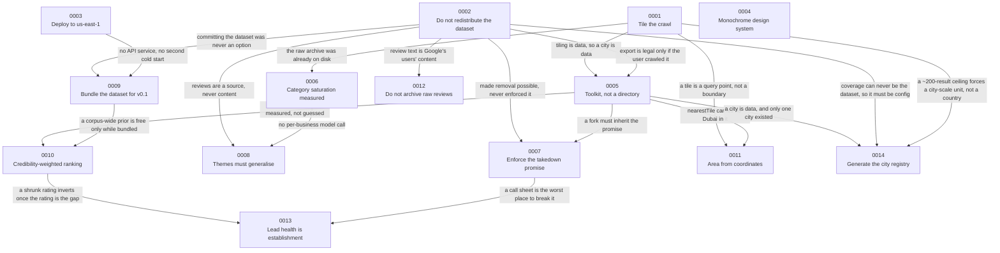

# Architecture decision records

An ADR here is the written record of a decision at the moment it was taken — the
context that forced it, what was chosen, what it costs, and what was rejected and
why. It is not documentation of how the code works; the code is better at that.
It is the reasoning, which the code cannot hold. The rule this repository follows
is that a decision gets written down **when it is made, including when it turns
out to be wrong** — and then the wrong part stays in the file rather than being
quietly edited out. [ADR 0006](./0006-category-saturation.md) publishes a
projection of 1,100–1,300 distinct categories against a measured 1,560, an
undershoot of 20–42% of its own value, under a heading that says so.
[ADR 0004](./0004-design-system.md) records a type system that shipped at 12–14px
with a hard-coded 10px on every listing row, was unreadable, and had to be rebuilt
around a 17px base — along with the discovery that the Arabic face the same
document promised "rather than a fallback" had never actually rendered. Those
entries are the point of the directory, not blemishes on it. A decision record
that only contains decisions that worked is a marketing page.

## The records

| #                                                       | Title                                                                                         | Status                               | Date       | Decides                                                                                                                                                                     |
| ------------------------------------------------------- | --------------------------------------------------------------------------------------------- | ------------------------------------ | ---------- | --------------------------------------------------------------------------------------------------------------------------------------------------------------------------- |
| [0001](./0001-tile-the-crawl.md)                        | Tile the crawl geographically, because one query is capped at ~200 results                    | Accepted                             | 2026-08-20 | A city is crawled as named geographic tiles, one query per tile-and-category pair, with pagination depth decided at run time — the ~200 ceiling is per query, not per page. |
| [0002](./0002-do-not-redistribute-the-dataset.md)       | Ship the pipeline, not the dataset                                                            | Accepted                             | 2026-08-20 | The crawled dataset is never committed. The repository ships the pipeline, the city configs, the taxonomy map, the suppression list and a handful of fixtures.              |
| [0003](./0003-deploy-region.md)                         | Deploy to `us-east-1`, and design around the distance                                         | Accepted · supersedes `me-central-1` | 2026-08-20 | Everything runs in `us-east-1` on `nodejs24.x`, and the ~250 ms origin distance to Dubai is engineered around rather than apologised for.                                   |
| [0004](./0004-design-system.md)                         | Monochrome design system on Tailwind v4 + shadcn/ui                                           | Accepted · amended 2026-08-22        | 2026-08-20 | Strict black-and-white, typography carrying the whole hierarchy, four families including a real Arabic face for bilingual titles.                                           |
| [0005](./0005-toolkit-not-directory.md)                 | Ship a toolkit for any city, not a Dubai directory                                            | Accepted                             | 2026-08-21 | The deliverable is an open-source toolkit; `directory.pooyagolchian.com` is a reference deployment. A city becomes `data/cities/<id>.json`, not code.                       |
| [0006](./0006-category-saturation.md)                   | Category saturation is real, and it is now measured                                           | Accepted · verified 2026-08-21       | 2026-08-21 | Classify distinct category strings rather than businesses — 15,246 businesses yielded 1,788 distinct categories, a final marginal rate of 4.3 per 100.                      |
| [0007](./0007-enforce-the-takedown-promise.md)          | Enforce the takedown promise with a committed suppression list                                | Accepted                             | 2026-08-22 | Takedowns are enforced by a committed list of opaque `place_id` values applied on the load path, so `--from-archive` cannot bring a removed business back.                  |
| [0008](./0008-themes-must-generalise-and-be-topical.md) | Review themes must generalise, and must be topical                                            | Accepted · amended 2026-08-22        | 2026-08-21 | A theme publishes only if it recurs across ≥5 businesses **and** is either a word the business uses about itself or ≥0.75 concentrated in one `l1`.                         |
| [0009](./0009-bundle-the-dataset-into-the-lambda.md)    | Bundle the dataset into the Lambda for v0.1, and say plainly that it is a stopgap             | Accepted                             | 2026-08-21 | The crawl output is copied into `packages/web/.data` at build time and traced into the server function; a missing file exits 1 rather than deploying an empty site.         |
| [0010](./0010-credibility-weighted-ranking.md)          | Rank by a credibility-weighted mean, not a raw star average                                   | Accepted                             | 2026-08-22 | Listings default to `rankScore()`, with both parameters measured from the corpus — mean 4.49, median weight 76 on the Dubai crawl.                                          |
| [0011](./0011-area-from-coordinates-not-provenance.md)  | Assign a business to an area by its coordinates, not by the query that found it               | Accepted                             | 2026-08-21 | Area comes from the nearest tile centre; crawl provenance is a fallback, because it disagreed with geography for 52% of businesses.                                         |
| [0012](./0012-do-not-archive-raw-review-responses.md)   | Do not archive raw review responses, unlike every other stage                                 | Accepted                             | 2026-08-21 | Stage 5 analyses reviews in memory and persists only derived signals. Archiving them would write reviewer name, contributor id and photograph to disk and to S3.            |
| [0013](./0013-lead-health-is-establishment.md)          | Score a lead's health by establishment, not by a rating                                       | Accepted                             | 2026-08-22 | `rankScore` is a shrunk rating, so it fell as a business grew: `corr(score, reviews)` was −0.28 on 641 leads. Now `reviews/(reviews+m)`, and +0.08.                         |
| [0014](./0014-generate-the-city-registry.md)            | Generate the city registry from OpenStreetMap, and mark every unverified config as unverified | **Proposed**                         | 2026-08-22 | Coverage is a generator, not a directory listing. A config is not the dataset, so it costs no credits; `verification` carries evidence, and its absence means unverified.   |

### Notes on the numbering

- **0001 was written last.** It is dated 2026-08-20 because that is when the
  decision was taken, but the file was created on 2026-08-22, after 0011. The
  number sat unused for the first eleven records while the reasoning lived in a
  comment above `PAGE_CAP`, in a `note` field, and in a `_readme` array — three
  places, none of them a decision record. It was reserved rather than reassigned
  precisely so the sequence could stay chronological when it was finally written.
- **There is no 0000, and nothing has been superseded.** ADR 0003 supersedes the
  original `me-central-1` region choice, which was never itself an ADR, so no
  file in this directory is retired.
- **0012 was spoken for before it existed, and the gap has now been closed.**
  ADR 0008 cited "ADR 0012" for the reviews stage's deliberate refusal to
  archive raw responses while that document did not exist, so for two days the
  citation pointed at nothing — a commitment rather than a link. It was
  honoured on 2026-08-22 by
  [0012](./0012-do-not-archive-raw-review-responses.md), dated 2026-08-21
  because that is when the decision was taken, the same way 0001 is. The
  reservation held in the meantime, and that was the whole point of writing it
  down: the number was never available for reassignment, and twice it was
  nearly reassigned anyway.
- **It nearly happened twice, which is why the note above stays.**
  Lead-generation scoring was drafted as 0012 and renumbered to **0013**; the
  city-registry decision was then _also_ drafted as 0012 — in
  `docs/superpowers/specs/2026-08-22-global-city-registry-design.md`, which said
  "Proposed: ADR 0012" — and was renumbered to **0014** on the same discovery. A
  note that catches the same mistake twice in three days is load-bearing, so it
  stays at the top of this section rather than being folded into the table now
  that the underlying gap is filled.

## How the decisions depend on each other

Most of these were not free choices. Each arrow reads "forces", and the label is
the reason the downstream decision had no room to be anything else.

Three relationships that look like edges are deliberately not drawn, because they
do not survive reading the arrow as "forces". **0001 → 0004** was an edge
labelled "titles arrive bilingual": the corpus forces the Arabic face, and it
would be bilingual under any crawl strategy, so tiling has nothing to do with
it. **0009 → 0011** was labelled "a correction is a rebuild, not a patch": that
is 0011 _inheriting a cost_ from 0009 — it appears in 0011's Bad list as exactly
that — and the two are dated the same day, so neither forced the other.
**0011 → 0014** fails the same test: a generated tile set rewrites the `/area/`
URLs 0011 established, and that sits in 0014's Bad list as an inherited cost, but
0011 did nothing to force the registry into existence.

Three of those edges are worth reading in full, because they are the ones where a
decision would be unenforceable or unmeasurable on its own:

- **0002 → 0007.** Not committing the dataset removes the _permanence_ problem —
  you cannot un-publish a record that lives in a public git object. It does
  nothing about the _recurrence_ problem, which is the one a business owner
  actually experiences. ADR 0002 claimed the takedown promise was enforceable; it
  had only made it possible, and 0007 is what closes the gap.
- **0002 → 0005.** Export collides head-on with "do not redistribute" if the data
  came from our crawl, and does not collide at all if it came from the user's.
  The toolkit reframe is how export becomes legal rather than forbidden.
- **0001 → 0006.** The saturation measurement cost zero API credits because Stage
  1 archives every raw response before parsing, so the corpus was already sitting
  on disk. That archive exists only because the crawl was designed to be
  re-runnable against the ~200-result ceiling. Without the tiling decision there
  is no corpus to measure, and the project's central cost claim stays an
  assertion.

## How to add one

The next free number is **0015**, and for the first time since 0008 nothing has
a standing claim on anything. ADR 0008's reservation on 0012 was discharged on
2026-08-22; see the note above for how twice the number was nearly reassigned
before that happened.

Filename is `NNNN-kebab-case-title.md`, and the `# ADR NNNN — Title` heading
inside must match it. Sections, in order:

1. **Front matter** — `Status`, `Date`, and `Supersedes` when it applies.
2. **Context** — what forced the decision. Cite the file, the fixture, the commit
   or the measurement that made the problem visible. If a defect prompted it, say
   how it was found, including when it was found by reading output rather than by
   a test.
3. **Decision** — what is being done, in the present tense, with the constants and
   the function names. Name the file the behaviour lives in.
4. **Consequences** — split into **Good** and **Bad**.
5. **Alternatives considered** — each with the reason it lost. "Deferred" is a
   legitimate outcome and is more honest than "rejected" when the option is
   actually the right long-term answer.

When you cite another ADR, give the filename alongside the number the way the
existing records do, so the reference survives being quoted out of the directory.

**The standing rule: the Bad list must be real.** It is the section that makes the
rest of the document worth anything, and it is the section under the most pressure
to become a formality. Two tests for whether an entry qualifies:

- It should cost something you would rather not admit. "Every lookup is a linear
  scan of 14,981 records", "it structurally favours incumbents", "a name that is
  common within a single vertical still gets through", "for two days the
  repository published a guarantee it could only have kept by accident" — those
  are the entries that make the Good list believable.
- It should be specific enough that someone could act on it. A named function, a
  measured number, or a failure mode with a scenario attached. "There are
  trade-offs" is not a consequence.

If a decision genuinely has no bad consequences, it is very likely not a decision
worth an ADR. And every number in the document must be traceable to a file in this
repository, to the measured-facts table in `CLAUDE.md`, or to an ADR that already
carries it. Where a figure cannot be sourced, drop the claim rather than estimate
it — that constraint is what makes the ones that are here mean anything.
